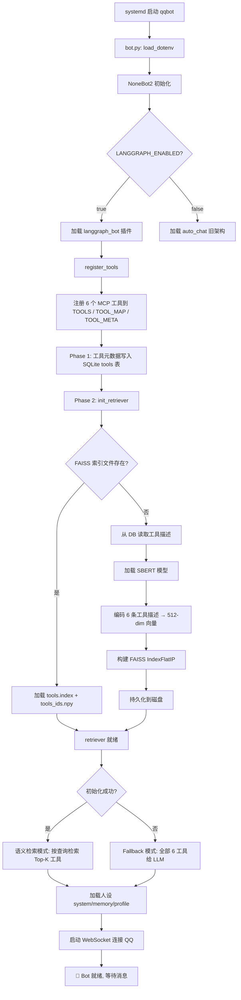
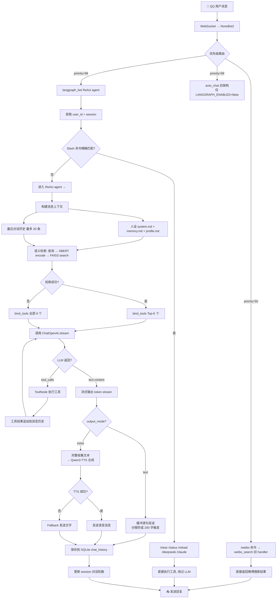
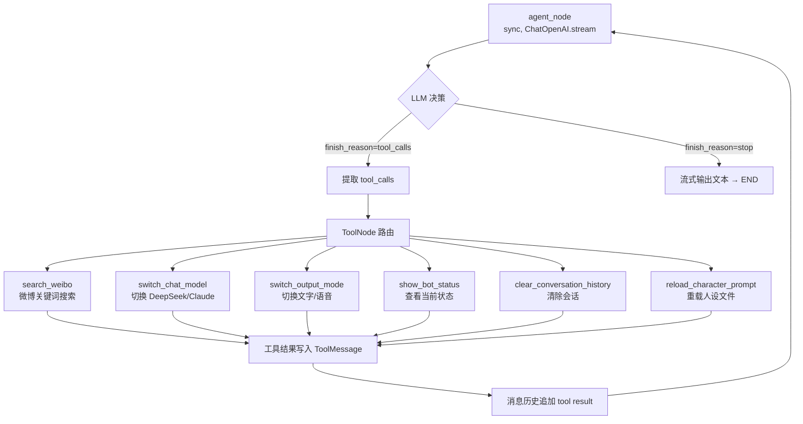
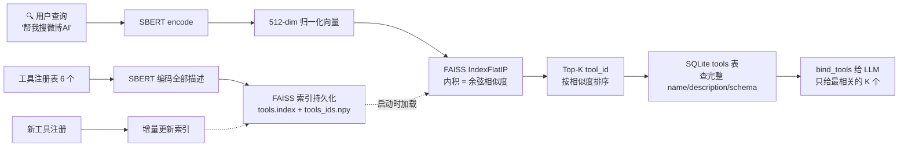
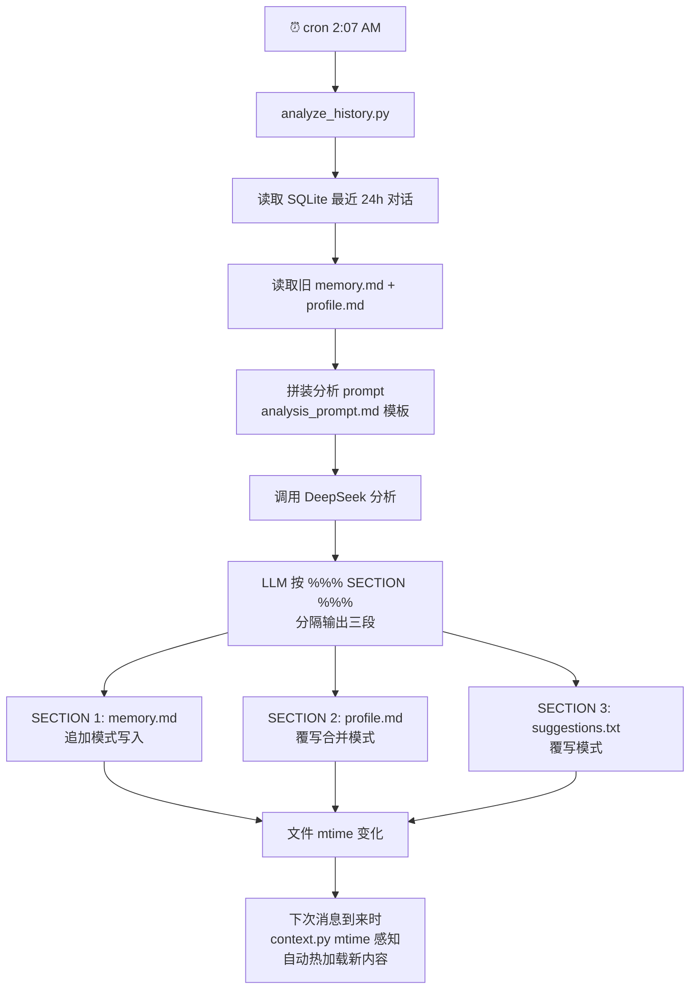
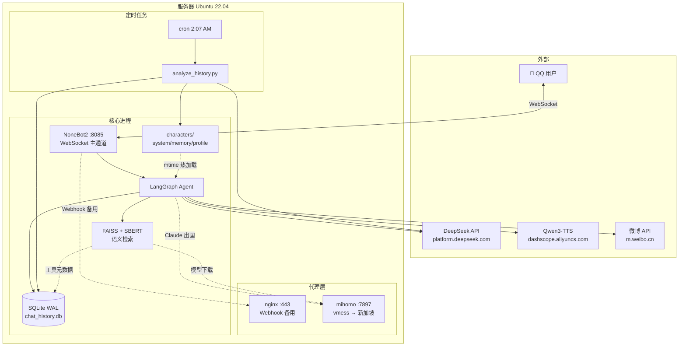

# 项目运行流程

## 1. 启动初始化

## 2. 消息处理主流程

## 3. Tool Calling 内部循环

## 4. 语义检索流程

## 5. 每日分析管道

## 6. 完整架构拓扑

## 关键数据流

| 数据 | 来源 | 去向 | 时机 |
|------|------|------|------|
| 用户消息 | QQ WebSocket | agent_node | 实时 |
| Token 流 | DeepSeek SSE | streaming.py → QQ | 实时 |
| 对话记录 | streaming.py | SQLite chat_history | 每条消息 |
| 工具元数据 | tools/__init__.py | SQLite tools 表 | 启动时 |
| FAISS 索引 | SBERT encode | tools.index + tools_ids.npy | 启动时 |
| 每日分析 | cron → DeepSeek | memory.md / profile.md | 凌晨 2:07 |
| 人设加载 | characters/*.md | agent_node system prompt | 每次请求 (mtime 缓存) |
| 工具选择 | 用户查询 → FAISS | bind_tools → LLM | 每次请求 |
